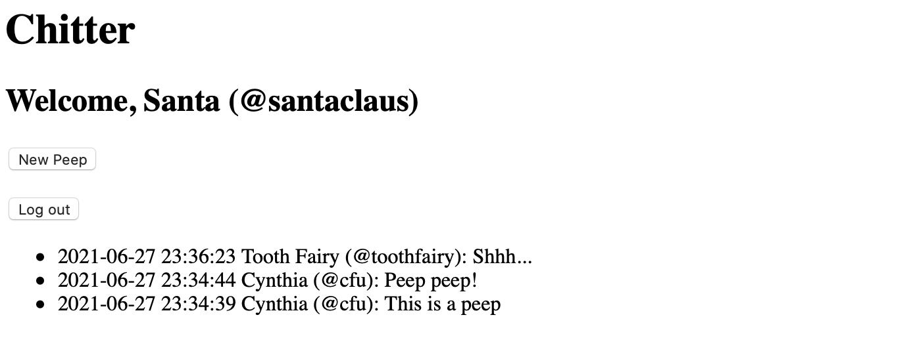
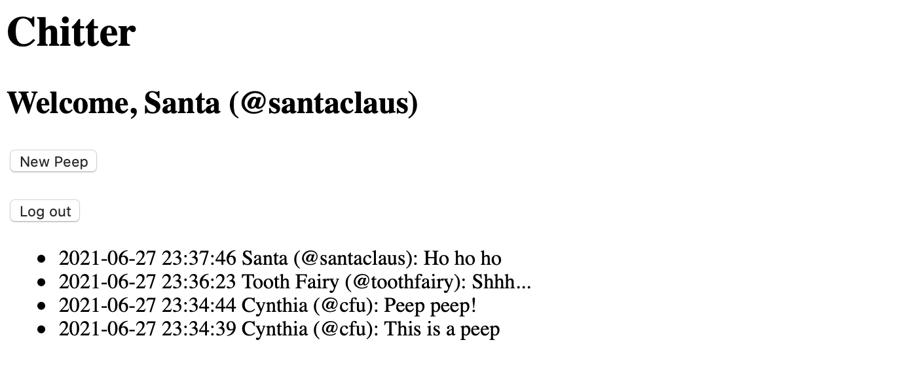

Chitter Challenge
=================

* Feel free to use Google, your notes, books, etc. but work on your own
* If you refer to the solution of another coach or student, please put a link to that in your README
* If you have a partial solution, **still check in a partial solution**
* You must submit a pull request to this repo with your code by 9am Monday morning

Challenge:
-------

As usual please start by forking this repo.

We are going to write a small Twitter clone that will allow the users to post messages to a public stream.

Features:
-------

```
STRAIGHT UP

As a Maker
So that I can let people know what I am doing  
I want to post a message (peep) to chitter

As a maker
So that I can see what others are saying  
I want to see all peeps in reverse chronological order

As a Maker
So that I can better appreciate the context of a peep
I want to see the time at which it was made

As a Maker
So that I can post messages on Chitter as me
I want to sign up for Chitter

HARDER

As a Maker
So that only I can post messages on Chitter as me
I want to log in to Chitter

As a Maker
So that I can avoid others posting messages on Chitter as me
I want to log out of Chitter

ADVANCED

As a Maker
So that I can stay constantly tapped in to the shouty box of Chitter
I want to receive an email if I am tagged in a Peep
```

Technical Approach:
-----

In this unit, you integrated a database into Bookmark Manager using the `PG` gem and `SQL` queries. You can continue to use this approach when building Chitter Challenge.

If you'd like more technical challenge now, try using an [Object Relational Mapper](https://en.wikipedia.org/wiki/Object-relational_mapping) as the database interface.

Some useful resources:
**DataMapper**
- [Datamapper wiki](https://en.wikipedia.org/wiki/DataMapper)
- [Sinatra, PostgreSQL & DataMapper recipe](https://github.com/sinatra/sinatra-recipes/blob/master/databases/postgresql-datamapper.md)

**Ruby Object Mapper**
- [ROM](https://rom-rb.org/)

**ActiveRecord**
- [ActiveRecord ORM](https://guides.rubyonrails.org/active_record_basics.html)
- [Sinatra, PostgreSQL & ActiveRecord recipe](http://recipes.sinatrarb.com/p/databases/postgresql-activerecord?#article)

Notes on functionality:
------

* You don't have to be logged in to see the peeps.
* Makers sign up to chitter with their email, password, name and a username (e.g. samm@makersacademy.com, password123, Sam Morgan, sjmog).
* The username and email are unique.
* Peeps (posts to chitter) have the name of the maker and their user handle.
* Your README should indicate the technologies used, and give instructions on how to install and run the tests.

Bonus:
-----

If you have time you can implement the following:

* In order to start a conversation as a maker I want to reply to a peep from another maker.

And/Or:

* Work on the CSS to make it look good.

Good luck and let the chitter begin!

Code Review
-----------

In code review we'll be hoping to see:

* All tests passing
* High [Test coverage](https://github.com/makersacademy/course/blob/main/pills/test_coverage.md) (>95% is good)
* The code is elegant: every class has a clear responsibility, methods are short etc.

Reviewers will potentially be using this [code review rubric](docs/review.md).  Referring to this rubric in advance may make the challenge somewhat easier.  You should be the judge of how much challenge you want at this moment.

Automated Tests:
-----

Opening a pull request against this repository will will trigger Travis CI to perform a build of your application and run your full suite of RSpec tests. If any of your tests rely on a connection with your database - and they should - this is likely to cause a problem. The build of your application created by has no connection to the local database you will have created on your machine, so when your tests try to interact with it they'll be unable to do so and will fail.

If you want a green tick against your pull request you'll need to configure Travis' build process by adding the necessary steps for creating your database to the `.travis.yml` file.

- [Travis Basics](https://docs.travis-ci.com/user/tutorial/)
- [Travis - Setting up Databases](https://docs.travis-ci.com/user/database-setup/)

Notes on test coverage
----------------------

Please ensure you have the following **AT THE TOP** of your spec_helper.rb in order to have test coverage stats generated
on your pull request:

```ruby
require 'simplecov'
require 'simplecov-console'

SimpleCov.formatter = SimpleCov::Formatter::MultiFormatter.new([
  SimpleCov::Formatter::Console,
  # Want a nice code coverage website? Uncomment this next line!
  # SimpleCov::Formatter::HTMLFormatter
])
SimpleCov.start
```

You can see your test coverage when you run your tests. If you want this in a graphical form, uncomment the `HTMLFormatter` line and see what happens!

# My Solution
A Makers Week 4 solo weekend challenge.

* **Languages used**: Ruby, HTML, SQL
* **Technology used**:
  * RSpec (unit testing)
  * Capybara (feature testing)
  * Sinatra & Rack (handling requests and responses)
  * PG (Ruby Postgres bridge)
  * bcrypt (password encryption with salts)
* **Database**: PostgreSQL

## Usage

### To set up the project

Clone this repository. Then install Gems required using bundler:
```
bundle install
```

### To set up the database

Connect to `psql` and create the `chitter` and `chitter_test` databases:
```
CREATE DATABASE chitter;
CREATE DATABASE chitter_test;
```

Connect to the database using:
```
\c chitter;
```
OR
```
\c chitter_test;
```

Then set up the appropriate tables in each database by running the SQL scripts in the `db/migrations` folder in the given order.

### To run the Chitter app

Start the server in the terminal using:
```
rackup
```
Note down the port number and access the website via:
http://localhost:PORT_NUMBER/peeps

### To run tests:

```
rspec
```

To run feature tests only:
```
rspec spec/features
```

## Domain Model

### CRC

```
|-----------------------------------|
|           Peep (message)          |
|-----------------------------------|
| Responsibilities |  Collaborators |
|-----------------------------------|
| has text         |  User          |
| has timestamp    |                |
| knows user       |                |
|-----------------------------------|

|-----------------------------------------|
|                   User                  |
|-----------------------------------------|
| Responsibilities        | Collaborators |
|-----------------------------------------|
| has username            |               |
| has name                |               |
| has email               |               |
| has encrypted password  |               |
|-----------------------------------------|

```
Relationships: many-to-one

### Database Structure

```
Table: Peeps
|------------------------------------------------|-----------|
|  peep_id  |  peep_text         |  peeped_on    |  user_id  |
|------------------------------------------------|-----------|
|     1     |  "This is a peep"  |  date & time  |     1     |
|------------------------------------------------|-----------|

Table: Users
|----------|-------------------------|----------------------|--------------|------------|
| user_id  |  email                  |  password            |  name        |  username  |
|----------|-------------------------|----------------------|--------------|------------|
|    1     |  cynthia@fakeemail.com  |  encrypted password  |  Cynthia Fu  |     cfu    |
|----------|-------------------------|----------------------|--------------|------------|
```

## Approach

In general, I followed the TDD cycle of RED-GREEN-REFACTOR, then used Rubocop to lint, all following the MVC pattern.

1. Looking at the User Stories, I drafted a Domain Model (as shown above) using the Class Responsibility Collaborator (CRC) cards approach.
2. I set up the Web Project:
    * Sinatra and Rack for handling requests and responses
    * Capybara for feature testing
    * RSpec for unit testing
3. Set up the first feature, the index page
4. Set up the feature for viewing peeps, then refactored using MVC logic by implementing a `Peep` class (the model), and a peep index page view.
5. I created a database called `chitter` and created a `peeps` table within it.
6. Installed the `pg` ruby gem that allows a connection to be made with PostgreSQL and handle queries. Then attached the database to the web application.
7. Set up the test environment.
8. Implemented the feature of 'adding peeps to the database', from browser to database, using MVC pattern.
9. From the 2nd and 3rd user story, a timestamp is required on each peep. I updated the peeps tables to include a peeped_on column that logs the time it was created. Then TDD'd the feature for having a timestamp on the peeps. 
10. Wrapped database data in program objects.
11. Extracted database connection logic to a `DatabaseConnection` object, set up a persistent connection to the correct database with method `setup`. Wrapped PG's `exec` method with a method, `DatabaseConnection.query`, that executes queries on the database.
12. Implemented the feature 'peeps are in reverse chronological order'. I used the `ORDER BY` SQL query when retrieving the list of peeps.
13. Created the users table, updated the test setup to truncate the user table between each test.
14. Test drove user sign up/registration
15. Implemented password encryption using `bcrypt` gem. Passwords are now stored in the db in an encrypted format with salting.
16. Considered edge cases where users try to sign up with a non-unique username/email. I used the `sinatra-flash` gem to display an error message on the page. A unique error message is displayed depending on which (username or email) is invalid. 
17. Test drove user log in feature - happy paths and unhappy paths (wrong email/password)
18. Test drove user log out feature - log in & log out buttons only appear on Chitter when appropriate.
19. Implemented user sign up cannot have blank fields. 
20. Implemented user must be logged in to peep.
21. "New peep" button created on peeps page.
22. Added foreign key to peeps table for user ids.
23. Added names and usernames to peeps.
24. Added 'register' button to peeps page.
25. Renamed Sign in/Sign out to Log in/Log out to match user story.

## Test Coverage

```
COVERAGE:  99.73% -- 366/367 lines in 17 files

+----------+------------------------------+-------+--------+---------+
| coverage | file                         | lines | missed | missing |
+----------+------------------------------+-------+--------+---------+
|  75.00%  | database_connection_setup.rb | 4     | 1      | 6       |
+----------+------------------------------+-------+--------+---------+
16 file(s) with 100% coverage not shown
```

Conclusion: Not necessary to test this line.

## Examples
Viewing Peeps and 'Log in' & 'Register' options:


Log in as Santa:


Welcome message and 'New Peep' & 'Log out' options:



New Peep:




Log out:


Register:


Unhappy paths:


## TODO
* Improvement: Model retreives data in String format - Date formatting?
* Q: Time delay when storing Time.now for Feature Tests. Unable to freeze time using timecop gem?
* Issue: Unable to write peeps with `'` characters due to the way the data is being fetched from the db.
* Improvement: condition logic for email/username uniqueness in `.create` method in User class, and in controller.
* Q: does Capybara form submission (click button) surpass required fields in HTML forms?
* Improvement: isolate peep class and user class. Not sure how to isolate - need real user_id, the peep table verifies foreign keys
* Improvement: add CSS
* Improvement: add screenshots demo-ing the app in README
* Improvement: rubocop linter - Layout/LineLength: Line is too long - how to improve line length for necessary SQL query?
